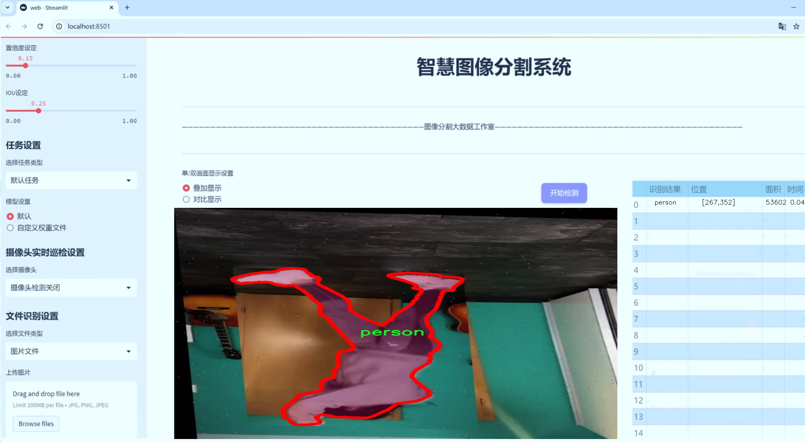
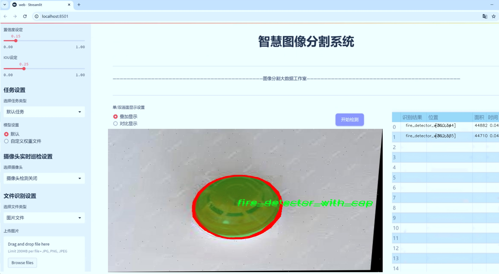
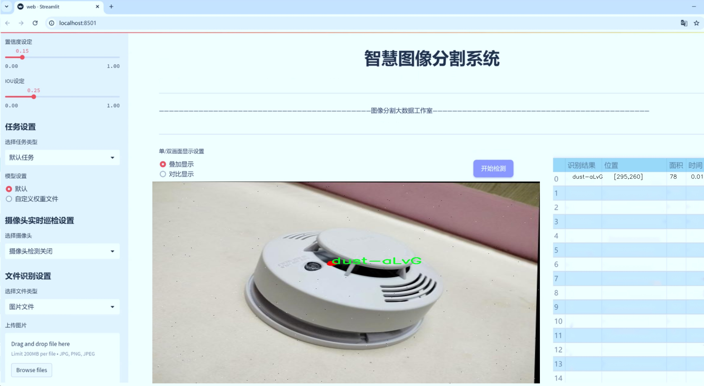
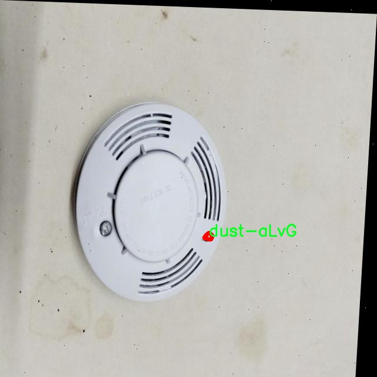
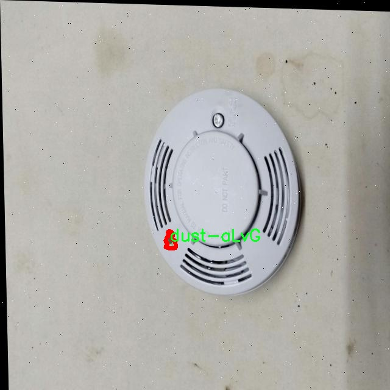
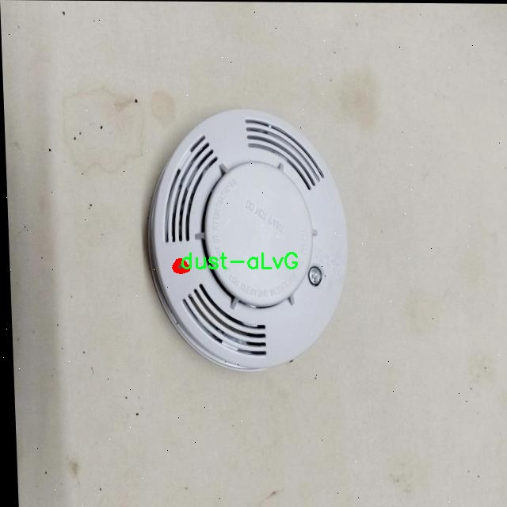
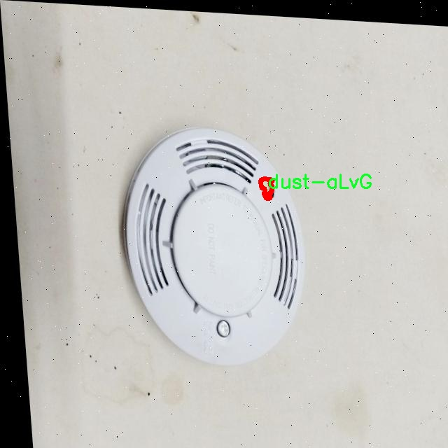
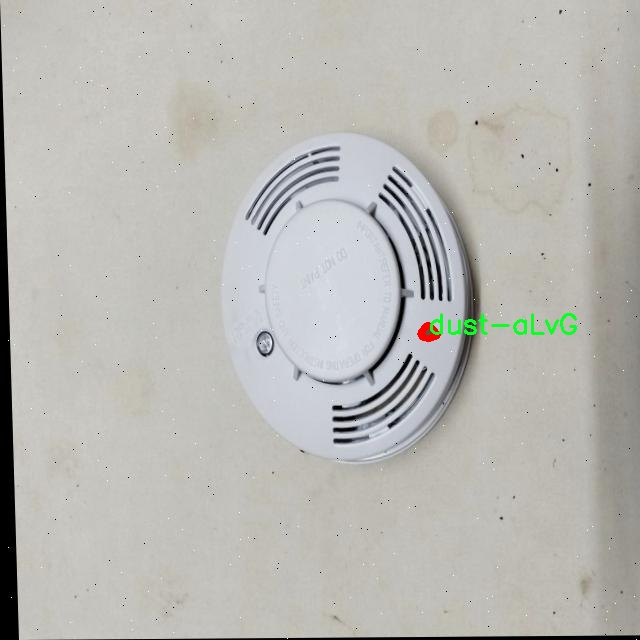

# 火灾探测器灰尘缺陷识别图像分割系统源码＆数据集分享
 [yolov8-seg-C2f-RFCBAMConv＆yolov8-seg-act等50+全套改进创新点发刊_一键训练教程_Web前端展示]

### 1.研究背景与意义

项目参考[ILSVRC ImageNet Large Scale Visual Recognition Challenge](https://gitee.com/YOLOv8_YOLOv11_Segmentation_Studio/projects)

项目来源[AAAI Global Al lnnovation Contest](https://kdocs.cn/l/cszuIiCKVNis)

研究背景与意义

随着城市化进程的加快和工业化水平的提高，火灾事故的发生频率逐年上升，给人们的生命财产安全带来了严重威胁。火灾不仅造成了巨大的经济损失，还对生态环境和社会稳定产生了深远影响。因此，火灾探测技术的研究与应用显得尤为重要。传统的火灾探测方法多依赖于烟雾、温度等物理参数的监测，然而这些方法在复杂环境下的准确性和及时性常常受到限制。近年来，计算机视觉技术的快速发展为火灾探测提供了新的思路，尤其是基于深度学习的图像处理技术在目标检测和图像分割方面的应用，极大地提升了火灾探测的智能化水平。

在此背景下，YOLO（You Only Look Once）系列模型因其高效的实时检测能力而受到广泛关注。YOLOv8作为该系列的最新版本，具备了更强的特征提取能力和更高的检测精度，能够在复杂场景中快速识别目标。然而，火灾探测的实际应用中，环境因素如灰尘、烟雾等可能对检测结果产生干扰，导致误报或漏报。因此，针对火灾探测中的灰尘缺陷识别问题，改进YOLOv8模型以提高其在复杂环境下的鲁棒性和准确性，具有重要的研究意义。

本研究将基于改进YOLOv8的火灾探测器，构建一个灰尘缺陷识别图像分割系统。为此，我们使用了Honeywell模块提供的数据集，该数据集包含1500张图像，涵盖了四个类别，包括灰尘、火灾探测器及其带盖的版本。通过对这些图像进行实例分割，我们可以有效地识别出图像中的不同目标，并对其进行精确的定位和分类。这一过程不仅有助于提高火灾探测的准确性，还能为后续的自动化处理提供基础数据支持。

在技术层面，本研究将探讨如何通过改进YOLOv8模型的网络结构和训练策略，提升其在灰尘环境下的检测性能。我们将采用数据增强、迁移学习等技术手段，提升模型的泛化能力，确保其在不同场景下的稳定性。此外，针对图像分割的需求，我们将结合深度学习中的最新技术，如U-Net和Mask R-CNN，优化模型的分割效果，以实现更高的检测精度。

总之，本研究不仅具有重要的理论价值，也具备广泛的应用前景。通过构建基于改进YOLOv8的火灾探测器灰尘缺陷识别图像分割系统，我们希望能够为火灾探测技术的发展提供新的思路和方法，为提升火灾安全监测的智能化水平贡献力量。最终，期望该系统能够在实际应用中发挥重要作用，为火灾防控提供更加可靠的技术支持。

### 2.图片演示







##### 注意：由于此博客编辑较早，上面“2.图片演示”和“3.视频演示”展示的系统图片或者视频可能为老版本，新版本在老版本的基础上升级如下：（实际效果以升级的新版本为准）

  （1）适配了YOLOV8的“目标检测”模型和“实例分割”模型，通过加载相应的权重（.pt）文件即可自适应加载模型。

  （2）支持“图片识别”、“视频识别”、“摄像头实时识别”三种识别模式。

  （3）支持“图片识别”、“视频识别”、“摄像头实时识别”三种识别结果保存导出，解决手动导出（容易卡顿出现爆内存）存在的问题，识别完自动保存结果并导出到tempDir中。

  （4）支持Web前端系统中的标题、背景图等自定义修改，后面提供修改教程。

  另外本项目提供训练的数据集和训练教程,暂不提供权重文件（best.pt）,需要您按照教程进行训练后实现图片演示和Web前端界面演示的效果。

### 3.视频演示

[3.1 视频演示](https://www.bilibili.com/video/BV1ENSYYpEdK/)

### 4.数据集信息展示

##### 4.1 本项目数据集详细数据（类别数＆类别名）

nc: 4
names: ['dust-aLvG', 'fire detector', 'fire_detector_with_cap', 'person']


##### 4.2 本项目数据集信息介绍

数据集信息展示

在本研究中，我们使用了名为“Honeywell”的数据集，旨在训练和改进YOLOv8-seg模型，以实现高效的火灾探测器灰尘缺陷识别图像分割系统。该数据集的设计考虑了火灾探测器在实际应用中的多样性和复杂性，尤其是在不同环境条件下的表现。通过精心标注的图像，Honeywell数据集为模型的训练提供了丰富的样本，确保其在真实场景中的适应性和准确性。

Honeywell数据集包含四个主要类别，分别是“dust-aLvG”、“fire detector”、“fire_detector_with_cap”和“person”。每个类别的选择都基于火灾探测器在实际使用中可能遇到的不同情况，尤其是灰尘对探测器性能的影响。首先，“dust-aLvG”类别专注于灰尘对火灾探测器的潜在干扰，灰尘的积聚可能导致探测器的误报或漏报，因此，识别和分割这些灰尘区域是提升探测器可靠性的关键。其次，“fire detector”类别涵盖了标准火灾探测器的图像，模型需要能够准确识别和定位这些设备，以便在发生火灾时及时发出警报。第三个类别“fire_detector_with_cap”则包括了带有保护盖的火灾探测器，这种设计在某些环境中更为常见，保护盖的存在可能会影响探测器的灵敏度，因此，识别此类设备同样重要。最后，“person”类别的引入则是为了增强模型在复杂场景中的表现，特别是在火灾发生时，人员的存在可能会影响探测器的工作状态和报警机制。

通过对这些类别的深入分析，我们可以看到，Honeywell数据集不仅提供了丰富的图像样本，还涵盖了与火灾探测器相关的多种环境因素。每个类别的图像都经过精确标注，确保在训练过程中，模型能够学习到不同类别之间的特征差异，从而提高其分割和识别的准确性。数据集中的图像涵盖了多种光照条件、背景环境和物体姿态，确保模型在多变的实际应用场景中具备良好的鲁棒性。

在数据集的构建过程中，研究团队还特别关注了样本的多样性和代表性，确保每个类别的样本数量均衡，以避免模型在训练过程中出现偏差。此外，数据集还考虑到了不同类型火灾探测器的外观差异，确保模型能够适应市场上各种型号的探测器。通过这样的设计，Honeywell数据集为改进YOLOv8-seg模型提供了坚实的基础，使其在火灾探测和灰尘缺陷识别方面的表现更加出色。

综上所述，Honeywell数据集不仅是一个简单的图像集合，更是一个经过深思熟虑、精心设计的资源，旨在推动火灾探测技术的发展。通过对该数据集的深入挖掘和分析，我们期望能够训练出一个高效、准确的火灾探测器灰尘缺陷识别图像分割系统，为提升火灾安全提供有力支持。











### 5.全套项目环境部署视频教程（零基础手把手教学）

[5.1 环境部署教程链接（零基础手把手教学）](https://www.bilibili.com/video/BV1jG4Ve4E9t/?vd_source=bc9aec86d164b67a7004b996143742dc)


[5.2 安装Python虚拟环境创建和依赖库安装视频教程链接（零基础手把手教学）](https://www.bilibili.com/video/BV1nA4VeYEze/?vd_source=bc9aec86d164b67a7004b996143742dc)

### 6.手把手YOLOV8-seg训练视频教程（零基础小白有手就能学会）

[6.1 手把手YOLOV8-seg训练视频教程（零基础小白有手就能学会）](https://www.bilibili.com/video/BV1cA4VeYETe/?vd_source=bc9aec86d164b67a7004b996143742dc)


按照上面的训练视频教程链接加载项目提供的数据集，运行train.py即可开始训练



     Epoch   gpu_mem       box       obj       cls    labels  img_size
     1/200     0G   0.01576   0.01955  0.007536        22      1280: 100%|██████████| 849/849 [14:42<00:00,  1.04s/it]
               Class     Images     Labels          P          R     mAP@.5 mAP@.5:.95: 100%|██████████| 213/213 [01:14<00:00,  2.87it/s]
                 all       3395      17314      0.994      0.957      0.0957      0.0843

     Epoch   gpu_mem       box       obj       cls    labels  img_size
     2/200     0G   0.01578   0.01923  0.007006        22      1280: 100%|██████████| 849/849 [14:44<00:00,  1.04s/it]
               Class     Images     Labels          P          R     mAP@.5 mAP@.5:.95: 100%|██████████| 213/213 [01:12<00:00,  2.95it/s]
                 all       3395      17314      0.996      0.956      0.0957      0.0845

     Epoch   gpu_mem       box       obj       cls    labels  img_size
     3/200     0G   0.01561    0.0191  0.006895        27      1280: 100%|██████████| 849/849 [10:56<00:00,  1.29it/s]
               Class     Images     Labels          P          R     mAP@.5 mAP@.5:.95: 100%|███████   | 187/213 [00:52<00:00,  4.04it/s]
                 all       3395      17314      0.996      0.957      0.0957      0.0845


### 7.50+种全套YOLOV8-seg创新点代码加载调参视频教程（一键加载写好的改进模型的配置文件）

[7.1 50+种全套YOLOV8-seg创新点代码加载调参视频教程（一键加载写好的改进模型的配置文件）](https://www.bilibili.com/video/BV1Hw4VePEXv/?vd_source=bc9aec86d164b67a7004b996143742dc)

### 8.YOLOV8-seg图像分割算法原理

原始YOLOv8-seg算法原理

YOLOv8-seg作为YOLO系列模型的最新版本，于2023年1月正式推出，标志着计算机视觉领域在目标检测与实例分割任务上的又一次重要进步。该模型不仅在精度和执行时间上超越了前代模型，还在结构设计和功能实现上进行了全面的创新，成为当前最先进的实时目标检测与分割算法之一。YOLOv8-seg的设计理念是通过整合YOLOv5、YOLOv6、YOLOX等前辈模型的优点，提升模型的性能，同时保持工程化的简洁性和易用性，使得用户能够更方便地进行模型训练和应用。

YOLOv8-seg的核心结构由三个主要部分组成：Backbone、Neck和Head。Backbone负责特征提取，Neck则用于特征融合，而Head则是模型的输出部分，负责生成最终的检测和分割结果。与以往的YOLO版本相比，YOLOv8-seg在Backbone中引入了新的C2f模块，取代了原有的C3模块，显著增加了跳层连接和Split操作的数量。这种设计使得模型在特征提取时能够更好地捕捉到不同层次的特征信息，从而提高了检测精度。

在Neck部分，YOLOv8-seg采用了PAN（Path Aggregation Network）结构，通过上下采样和特征拼接的方式，将不同尺度的特征图进行有效融合。这种特征融合方法不仅增强了模型对小目标的检测能力，还提高了对复杂场景的适应性，使得YOLOv8-seg在处理高分辨率图像时表现得更加出色。此外，Neck部分的设计也经过了优化，去掉了冗余的卷积连接层，进一步提升了计算效率。

YOLOv8-seg的Head部分是其最显著的创新之一。与YOLOv5的Anchor-Based检测头不同，YOLOv8-seg采用了Anchor-Free的解耦头结构。这一变化不仅简化了模型的设计，还提高了检测精度。解耦头将分类和回归任务分开处理，消除了之前的objectness分支，使得模型在进行目标检测时能够更加专注于分类和定位的精确性。此外，YOLOv8-seg还引入了新的损失函数，通过优化损失计算方式，进一步提升了模型的泛化能力和精度。

在模型的设置方面，YOLOv8-seg允许用户根据具体需求调整depth_factor、width_factor和ratio等参数，以便灵活地控制模型的深度和宽度。这种灵活性使得YOLOv8-seg能够适应不同的应用场景，无论是需要高精度的图像分割任务，还是实时性要求较高的目标检测任务，用户都可以根据实际情况进行相应的配置。

值得注意的是，YOLOv8-seg在小目标检测和复杂背景下的表现也得到了显著提升。通过引入BiFormer双层路由注意力机制，YOLOv8-seg能够更好地捕捉远程依赖关系，保留特征提取过程中的细粒度上下文信息。这一改进使得模型在处理小目标时，能够有效降低漏检率，提升对小目标的感知能力。

综上所述，YOLOv8-seg算法通过对Backbone、Neck和Head的全面优化与创新，构建了一个高效、精准且易于使用的目标检测与实例分割模型。其在特征提取、特征融合和输出处理上的改进，使得YOLOv8-seg在各类计算机视觉任务中展现出卓越的性能，成为当前业界最受欢迎的模型之一。随着YOLOv8-seg的不断发展与应用，未来在智能监控、自动驾驶、医疗影像分析等领域，预计将发挥更加重要的作用。


### 9.系统功能展示（检测对象为举例，实际内容以本项目数据集为准）

图9.1.系统支持检测结果表格显示

  图9.2.系统支持置信度和IOU阈值手动调节

  图9.3.系统支持自定义加载权重文件best.pt(需要你通过步骤5中训练获得)

  图9.4.系统支持摄像头实时识别

  图9.5.系统支持图片识别

  图9.6.系统支持视频识别

  图9.7.系统支持识别结果文件自动保存

  图9.8.系统支持Excel导出检测结果数据


### 10.50+种全套YOLOV8-seg创新点原理讲解（非科班也可以轻松写刊发刊，V11版本正在科研待更新）

#### 10.1 由于篇幅限制，每个创新点的具体原理讲解就不一一展开，具体见下列网址中的创新点对应子项目的技术原理博客网址【Blog】：


[10.1 50+种全套YOLOV8-seg创新点原理讲解链接](https://gitee.com/qunmasj/good)

#### 10.2 部分改进模块原理讲解(完整的改进原理见上图和技术博客链接)【如果此小节的图加载失败可以通过CSDN或者Github搜索该博客的标题访问原始博客，原始博客图片显示正常】
### YOLOv8简介
#### Backbone


借鉴了其他算法的这些设计思想

借鉴了VGG的思想，使用了较多的3×3卷积，在每一次池化操作后，将通道数翻倍；

借鉴了network in network的思想，使用全局平均池化（global average pooling）做预测，并把1×1的卷积核置于3×3的卷积核之间，用来压缩特征；（我没找到这一步体现在哪里）

使用了批归一化层稳定模型训练，加速收敛，并且起到正则化作用。

    以上三点为Darknet19借鉴其他模型的点。Darknet53当然是在继承了Darknet19的这些优点的基础上再新增了下面这些优点的。因此列在了这里

借鉴了ResNet的思想，在网络中大量使用了残差连接，因此网络结构可以设计的很深，并且缓解了训练中梯度消失的问题，使得模型更容易收敛。

使用步长为2的卷积层代替池化层实现降采样。（这一点在经典的Darknet-53上是很明显的，output的长和宽从256降到128，再降低到64，一路降低到8，应该是通过步长为2的卷积层实现的；在YOLOv8的卷积层中也有体现，比如图中我标出的这些位置）

#### 特征融合

模型架构图如下

  Darknet-53的特点可以这样概括：（Conv卷积模块+Residual Block残差块）串行叠加4次

  Conv卷积层+Residual Block残差网络就被称为一个stage


上面红色指出的那个，原始的Darknet-53里面有一层 卷积，在YOLOv8里面，把一层卷积移除了

为什么移除呢？

        原始Darknet-53模型中间加的这个卷积层做了什么？滤波器（卷积核）的个数从 上一个卷积层的512个，先增加到1024个卷积核，然后下一层卷积的卷积核的个数又降低到512个

        移除掉这一层以后，少了1024个卷积核，就可以少做1024次卷积运算，同时也少了1024个3×3的卷积核的参数，也就是少了9×1024个参数需要拟合。这样可以大大减少了模型的参数，（相当于做了轻量化吧）

        移除掉这个卷积层，可能是因为作者发现移除掉这个卷积层以后，模型的score有所提升，所以才移除掉的。为什么移除掉以后，分数有所提高呢？可能是因为多了这些参数就容易，参数过多导致模型在训练集删过拟合，但是在测试集上表现很差，最终模型的分数比较低。你移除掉这个卷积层以后，参数减少了，过拟合现象不那么严重了，泛化能力增强了。当然这个是，拿着你做实验的结论，反过来再找补，再去强行解释这种现象的合理性。

过拟合


通过MMdetection官方绘制册这个图我们可以看到，进来的这张图片经过一个“Feature Pyramid Network(简称FPN)”，然后最后的P3、P4、P5传递给下一层的Neck和Head去做识别任务。 PAN（Path Aggregation Network）


“FPN是自顶向下，将高层的强语义特征传递下来。PAN就是在FPN的后面添加一个自底向上的金字塔，对FPN补充，将低层的强定位特征传递上去，

FPN是自顶（小尺寸，卷积次数多得到的结果，语义信息丰富）向下（大尺寸，卷积次数少得到的结果），将高层的强语义特征传递下来，对整个金字塔进行增强，不过只增强了语义信息，对定位信息没有传递。PAN就是针对这一点，在FPN的后面添加一个自底（卷积次数少，大尺寸）向上（卷积次数多，小尺寸，语义信息丰富）的金字塔，对FPN补充，将低层的强定位特征传递上去，又被称之为“双塔战术”。

FPN层自顶向下传达强语义特征，而特征金字塔则自底向上传达强定位特征，两两联手，从不同的主干层对不同的检测层进行参数聚合,这样的操作确实很皮。
#### 自底向上增强

而 PAN（Path Aggregation Network）是对 FPN 的一种改进，它的设计理念是在 FPN 后面添加一个自底向上的金字塔。PAN 引入了路径聚合的方式，通过将浅层特征图（低分辨率但语义信息较弱）和深层特征图（高分辨率但语义信息丰富）进行聚合，并沿着特定的路径传递特征信息，将低层的强定位特征传递上去。这样的操作能够进一步增强多尺度特征的表达能力，使得 PAN 在目标检测任务中表现更加优秀。


### 可重参化EfficientRepBiPAN优化Neck
#### Repvgg-style
Repvgg-style的卷积层包含
卷积+ReLU结构，该结构能够有效地利用硬件资源。

在训练时，Repvgg-style的卷积层包含
卷积、
卷积、identity。（下图左图）


在推理时，通过重参数化（re-parameterization），上述的多分支结构可以转换为单分支的
卷积。（下图右图）


基于上述思想，作者设计了对GPU硬件友好的EfficientRep Backbone和Rep-PAN Neck，将它们用于YOLOv6中。

EfficientRep Backbone的结构图：


Rep-PAN Neck结构图：


#### Multi-path
只使用repvgg-style不能达到很好的精度-速度平衡，对于大模型，作者探索了多路径的网络结构。

参考该博客提出了Bep unit，其结构如下图所示：


CSP（Cross Stage Partial）-style计算量小，且有丰富的梯度融合信息，广泛应用于YOLO系列中，比如YOLOv5、PPYOLOE。

作者将Bep unit与CSP-style结合，设计了一种新的网络结构BepC3，如下图所示：


基于BepC3模块，作者设计了新的CSPBep Backbone和CSPRepPAN Neck，以达到很好的精度-速度平衡。

其他YOLO系列在使用CSP-stype结构时，partial ratio设置为1/2。为了达到更好的性能，在YOLOv6m中partial ratio的值为2/3，在YOLOv6l中partial ratio的值为1/2。

对于YOLOv6m，单纯使用Rep-style结构和使用BepC3结构的对比如下图所示：

#### BIFPN
BiFPN 全称 Bidirectional Feature Pyramid Network 加权双向（自顶向下 + 自低向上）特征金字塔网络。

相比较于PANet，BiFPN在设计上的改变：

总结下图：
图d 蓝色部分为自顶向下的通路，传递的是高层特征的语义信息；红色部分是自底向上的通路，传递的是低层特征的位置信息；紫色部分是上述第二点提到的同一层在输入节点和输入节点间新加的一条边。


我们删除那些只有一条输入边的节点。这么做的思路很简单：如果一个节点只有一条输入边而没有特征融合，那么它对旨在融合不同特征的特征网络的贡献就会很小。删除它对我们的网络影响不大，同时简化了双向网络；如上图d 的 P7右边第一个节点

如果原始输入节点和输出节点处于同一层，我们会在原始输入节点和输出节点之间添加一条额外的边。思路：以在不增加太多成本的情况下融合更多的特性；

与只有一个自顶向下和一个自底向上路径的PANet不同，我们处理每个双向路径(自顶向下和自底而上)路径作为一个特征网络层，并重复同一层多次，以实现更高层次的特征融合。如下图EfficientNet 的网络结构所示，我们对BiFPN是重复使用多次的。而这个使用次数也不是我们认为设定的，而是作为参数一起加入网络的设计当中，使用NAS技术算出来的。


Weighted Feature Fusion 带权特征融合：学习不同输入特征的重要性，对不同输入特征有区分的融合。
设计思路：传统的特征融合往往只是简单的 feature map 叠加/相加 (sum them up)，比如使用concat或者shortcut连接，而不对同时加进来的 feature map 进行区分。然而，不同的输入 feature map 具有不同的分辨率，它们对融合输入 feature map 的贡献也是不同的，因此简单的对他们进行相加或叠加处理并不是最佳的操作。所以这里我们提出了一种简单而高效的加权特融合的机制。
常见的带权特征融合有三种方法，分别是：


​
  这种方法比较简单，直接加一个可学习的权重。但是由于这个权重不受限制，所有可能引起训练的不稳定，所有并不推荐。
Softmax-based fusion: O = ∑ i e w i ∗ I i ϵ + ∑ j e w j O = \sum_{i} \frac{e^{w_i} * I_i}{ \epsilon+\sum_{j}e^{w_j}}O=∑ 

 

​
  使用这种方法可以将范围放缩到 [ 0 , 1 ] [0, 1][0,1] 之间，训练稳定，但是训练很慢，所有也不推荐。
Fast normalized fusion: O = ∑ i w i ∗ I i ϵ + ∑ j w j O = \sum_{i} \frac{w_i * I_i}{ \epsilon+\sum_{j}w_j}O=∑ 


### 11.项目核心源码讲解（再也不用担心看不懂代码逻辑）

#### 11.1 ultralytics\engine\model.py

以下是经过精简和注释的核心代码部分，保留了 YOLO 模型的主要功能和结构。

```python
import torch
import inspect
import sys
from pathlib import Path
from typing import Union
from ultralytics.nn.tasks import nn  # 导入神经网络模块

class Model(nn.Module):
    """
    YOLO模型的基础类，统一所有模型的API。
    """

    def __init__(self, model: Union[str, Path] = 'yolov8n.pt', task=None) -> None:
        """
        初始化YOLO模型。

        Args:
            model (Union[str, Path], optional): 要加载或创建的模型路径或名称，默认为'yolov8n.pt'。
            task (Any, optional): YOLO模型的任务类型，默认为None。
        """
        super().__init__()
        self.model = None  # 模型对象
        self.task = task  # 任务类型
        model = str(model).strip()  # 去除空格

        # 加载或创建新的YOLO模型
        suffix = Path(model).suffix
        if suffix in ('.yaml', '.yml'):
            self._new(model, task)  # 从配置文件创建新模型
        else:
            self._load(model, task)  # 从权重文件加载模型

    def _new(self, cfg: str, task=None):
        """
        从配置文件初始化新模型。

        Args:
            cfg (str): 模型配置文件
            task (str | None): 模型任务
        """
        cfg_dict = yaml_model_load(cfg)  # 加载yaml配置
        self.task = task or guess_model_task(cfg_dict)  # 推测任务类型
        self.model = self._smart_load('model')(cfg_dict)  # 创建模型

    def _load(self, weights: str, task=None):
        """
        从权重文件加载模型。

        Args:
            weights (str): 要加载的模型权重
            task (str | None): 模型任务
        """
        self.model, _ = attempt_load_one_weight(weights)  # 加载权重
        self.task = self.model.args['task']  # 获取任务类型

    def predict(self, source=None, stream=False, **kwargs):
        """
        使用YOLO模型进行预测。

        Args:
            source (str | int | PIL | np.ndarray): 进行预测的图像来源。
            stream (bool): 是否流式预测，默认为False。

        Returns:
            List[ultralytics.engine.results.Results]: 预测结果。
        """
        if source is None:
            source = ASSETS  # 默认使用资产目录
        # 处理预测逻辑
        return self.model.predict(source=source, stream=stream, **kwargs)

    def train(self, trainer=None, **kwargs):
        """
        在给定数据集上训练模型。

        Args:
            trainer (BaseTrainer, optional): 自定义训练器。
            **kwargs (Any): 训练配置的任意数量的参数。
        """
        self.trainer = (trainer or self._smart_load('trainer'))(args=kwargs)  # 创建训练器
        self.trainer.train()  # 开始训练

    def _smart_load(self, key):
        """加载模型/训练器/验证器/预测器。"""
        try:
            return self.task_map[self.task][key]  # 根据任务类型加载相应的组件
        except Exception as e:
            raise NotImplementedError(f"模型不支持此任务类型: {self.task}") from e

    @property
    def task_map(self):
        """任务映射，返回模型任务到模式类的映射。"""
        raise NotImplementedError('请提供模型的任务映射！')

# 省略了其他方法和属性，专注于模型的初始化、加载、预测和训练等核心功能。
```

### 代码注释说明
1. **类定义**：`Model`类继承自`nn.Module`，是YOLO模型的基础类，负责模型的初始化、加载、预测和训练等功能。
2. **初始化方法**：在构造函数中，接收模型路径和任务类型，判断模型类型并调用相应的方法进行加载或创建。
3. **加载新模型**：`_new`方法从配置文件创建新模型，`_load`方法从权重文件加载模型。
4. **预测方法**：`predict`方法用于进行预测，接受图像来源和流式预测的参数。
5. **训练方法**：`train`方法用于在给定数据集上训练模型。
6. **智能加载**：`_smart_load`方法根据任务类型加载相应的组件，确保模型能够正确运行。
7. **任务映射**：`task_map`属性用于定义任务到模型、训练器、验证器和预测器的映射，需在子类中实现。

此代码保留了YOLO模型的核心功能，并添加了详细的中文注释，便于理解其工作原理。

这个文件是Ultralytics YOLO模型的核心实现部分，主要定义了一个名为`Model`的类，该类统一了所有YOLO模型的API。这个类提供了多种功能，包括模型的加载、预测、训练、验证和导出等。

在`Model`类的构造函数中，用户可以指定要加载的模型文件路径或名称，默认情况下加载的是'yolov8n.pt'。构造函数首先会检查模型的类型，支持Ultralytics HUB模型和Triton Server模型。如果模型是从HUB加载的，它会创建一个HUB训练会话；如果是Triton模型，则直接将模型路径赋值给`self.model`。接着，根据模型文件的后缀名判断是加载配置文件（.yaml）还是权重文件（.pt），并调用相应的方法进行初始化。

`Model`类中定义了多个方法。`__call__`方法是一个别名，用于调用`predict`方法进行目标检测。`_new`和`_load`方法分别用于初始化新模型和加载已有模型的权重，`_check_is_pytorch_model`方法用于检查加载的模型是否为PyTorch模型。

`predict`方法是模型进行预测的主要方法，接受多种输入源（如文件路径、视频流等），并返回预测结果。`track`方法用于在输入源上进行目标跟踪，`val`方法用于在给定数据集上验证模型的性能，`train`方法则用于训练模型。

此外，`Model`类还提供了超参数调优的功能，通过`tune`方法可以进行超参数搜索。模型的导出功能通过`export`方法实现，可以将模型导出为不同格式。

该类还实现了一些辅助功能，如重置模型权重、记录模型信息、融合模型层以加快推理速度等。通过`add_callback`、`clear_callback`和`reset_callbacks`等方法，用户可以管理训练过程中的回调函数。

总的来说，这个文件为YOLO模型的使用提供了一个全面的接口，涵盖了从模型加载到预测、训练、验证和导出的各个方面，方便用户在不同的任务中使用YOLO模型。

#### 11.2 ultralytics\nn\backbone\convnextv2.py

以下是代码中最核心的部分，并附上详细的中文注释：

```python
import torch
import torch.nn as nn
import torch.nn.functional as F

class LayerNorm(nn.Module):
    """ 自定义的层归一化 (Layer Normalization) 类，支持两种数据格式：channels_last 和 channels_first。 """
    def __init__(self, normalized_shape, eps=1e-6, data_format="channels_last"):
        super().__init__()
        # 权重和偏置参数
        self.weight = nn.Parameter(torch.ones(normalized_shape))
        self.bias = nn.Parameter(torch.zeros(normalized_shape))
        self.eps = eps  # 防止除零的微小值
        self.data_format = data_format  # 数据格式
        if self.data_format not in ["channels_last", "channels_first"]:
            raise NotImplementedError 
        self.normalized_shape = (normalized_shape, )
    
    def forward(self, x):
        # 根据数据格式选择不同的归一化方式
        if self.data_format == "channels_last":
            return F.layer_norm(x, self.normalized_shape, self.weight, self.bias, self.eps)
        elif self.data_format == "channels_first":
            u = x.mean(1, keepdim=True)  # 计算均值
            s = (x - u).pow(2).mean(1, keepdim=True)  # 计算方差
            x = (x - u) / torch.sqrt(s + self.eps)  # 标准化
            x = self.weight[:, None, None] * x + self.bias[:, None, None]  # 应用权重和偏置
            return x

class Block(nn.Module):
    """ ConvNeXtV2 的基本模块，包含深度可分离卷积和前馈网络。 """
    def __init__(self, dim, drop_path=0.):
        super().__init__()
        # 深度可分离卷积
        self.dwconv = nn.Conv2d(dim, dim, kernel_size=7, padding=3, groups=dim)
        self.norm = LayerNorm(dim, eps=1e-6)  # 归一化层
        self.pwconv1 = nn.Linear(dim, 4 * dim)  # 1x1 卷积（用线性层实现）
        self.act = nn.GELU()  # 激活函数
        self.pwconv2 = nn.Linear(4 * dim, dim)  # 1x1 卷积（用线性层实现）
        self.drop_path = nn.Identity() if drop_path <= 0. else DropPath(drop_path)  # 随机深度

    def forward(self, x):
        input = x  # 保存输入以便后续残差连接
        x = self.dwconv(x)  # 深度可分离卷积
        x = x.permute(0, 2, 3, 1)  # 转换维度 (N, C, H, W) -> (N, H, W, C)
        x = self.norm(x)  # 归一化
        x = self.pwconv1(x)  # 1x1 卷积
        x = self.act(x)  # 激活
        x = self.pwconv2(x)  # 1x1 卷积
        x = x.permute(0, 3, 1, 2)  # 转换维度 (N, H, W, C) -> (N, C, H, W)

        x = input + self.drop_path(x)  # 残差连接
        return x

class ConvNeXtV2(nn.Module):
    """ ConvNeXt V2 模型，包含多个阶段和块。 """
    def __init__(self, in_chans=3, num_classes=1000, 
                 depths=[3, 3, 9, 3], dims=[96, 192, 384, 768], 
                 drop_path_rate=0.):
        super().__init__()
        self.downsample_layers = nn.ModuleList()  # 下采样层
        # 初始卷积层
        stem = nn.Sequential(
            nn.Conv2d(in_chans, dims[0], kernel_size=4, stride=4),
            LayerNorm(dims[0], eps=1e-6, data_format="channels_first")
        )
        self.downsample_layers.append(stem)
        # 添加下采样层
        for i in range(3):
            downsample_layer = nn.Sequential(
                    LayerNorm(dims[i], eps=1e-6, data_format="channels_first"),
                    nn.Conv2d(dims[i], dims[i+1], kernel_size=2, stride=2),
            )
            self.downsample_layers.append(downsample_layer)

        self.stages = nn.ModuleList()  # 特征分辨率阶段
        cur = 0
        for i in range(4):
            stage = nn.Sequential(
                *[Block(dim=dims[i], drop_path=drop_path_rate) for _ in range(depths[i])]
            )
            self.stages.append(stage)

        self.norm = nn.LayerNorm(dims[-1], eps=1e-6)  # 最终归一化层
        self.head = nn.Linear(dims[-1], num_classes)  # 分类头

    def forward(self, x):
        for i in range(4):
            x = self.downsample_layers[i](x)  # 下采样
            x = self.stages[i](x)  # 特征提取
        return x  # 返回最后的特征

# 示例：创建 ConvNeXtV2 模型
model = ConvNeXtV2()
```

### 代码核心部分解释：
1. **LayerNorm**：实现了层归一化，支持两种数据格式（通道在最后或在最前）。
2. **Block**：ConvNeXtV2 的基本构建块，包含深度可分离卷积、归一化、前馈网络和残差连接。
3. **ConvNeXtV2**：整个模型的结构，包含多个下采样层和特征提取阶段，最终输出分类结果。

### 其他功能：
- `update_weight` 函数用于更新模型权重。
- 各种 `convnextv2_*` 函数用于创建不同规模的 ConvNeXtV2 模型。

这个程序文件实现了ConvNeXt V2模型的构建，主要用于计算机视觉任务。文件中首先导入了必要的库，包括PyTorch和一些用于模型构建的工具。接着定义了一些类和函数。

文件中的`LayerNorm`类实现了层归一化，支持两种数据格式：`channels_last`和`channels_first`。该类的构造函数接受归一化的形状、一个小的常数（eps）以避免除零错误，以及数据格式。`forward`方法根据输入数据的格式应用不同的归一化方法。

`GRN`类实现了全局响应归一化层，旨在通过对输入进行归一化来增强模型的表达能力。它通过计算输入的L2范数来实现归一化，并使用可学习的参数`gamma`和`beta`进行调整。

`Block`类定义了ConvNeXt V2的基本构建块。每个块包含一个深度卷积层、层归一化、一个点卷积层、激活函数、GRN层和另一个点卷积层。它还实现了随机深度（drop path）机制，以增强模型的泛化能力。

`ConvNeXtV2`类是整个模型的核心，构造函数中定义了输入通道数、分类头的类别数、每个阶段的块数、特征维度、随机深度率等参数。模型的前向传播通过一系列下采样层和多个残差块进行，最终输出特征图。

文件还定义了`update_weight`函数，用于更新模型的权重，确保模型字典和权重字典中的键匹配，并且形状一致。最后，提供了一系列函数（如`convnextv2_atto`、`convnextv2_femto`等）用于创建不同规模的ConvNeXt V2模型，这些函数可以加载预训练权重。

总体而言，这个文件实现了一个灵活且高效的卷积神经网络架构，适用于各种计算机视觉任务。

#### 11.3 ultralytics\models\yolo\classify\val.py

以下是经过简化和注释的核心代码部分：

```python
import torch
from ultralytics.data import ClassificationDataset, build_dataloader
from ultralytics.engine.validator import BaseValidator
from ultralytics.utils.metrics import ClassifyMetrics, ConfusionMatrix
from ultralytics.utils.plotting import plot_images

class ClassificationValidator(BaseValidator):
    """
    分类模型验证器，继承自BaseValidator类。
    该类用于基于分类模型进行验证。
    """

    def __init__(self, dataloader=None, save_dir=None, pbar=None, args=None, _callbacks=None):
        """初始化ClassificationValidator实例，设置数据加载器、保存目录、进度条和参数。"""
        super().__init__(dataloader, save_dir, pbar, args, _callbacks)
        self.targets = None  # 存储真实标签
        self.pred = None     # 存储预测结果
        self.args.task = 'classify'  # 设置任务类型为分类
        self.metrics = ClassifyMetrics()  # 初始化分类指标

    def init_metrics(self, model):
        """初始化混淆矩阵、类名和准确率指标。"""
        self.names = model.names  # 获取类别名称
        self.nc = len(model.names)  # 类别数量
        self.confusion_matrix = ConfusionMatrix(nc=self.nc, conf=self.args.conf, task='classify')  # 初始化混淆矩阵
        self.pred = []  # 预测结果列表
        self.targets = []  # 真实标签列表

    def preprocess(self, batch):
        """预处理输入批次并返回处理后的数据。"""
        batch['img'] = batch['img'].to(self.device, non_blocking=True)  # 将图像移动到设备上
        batch['img'] = batch['img'].half() if self.args.half else batch['img'].float()  # 根据参数选择数据类型
        batch['cls'] = batch['cls'].to(self.device)  # 将标签移动到设备上
        return batch

    def update_metrics(self, preds, batch):
        """更新运行指标，使用模型预测和批次目标。"""
        n5 = min(len(self.names), 5)  # 取前5个预测
        self.pred.append(preds.argsort(1, descending=True)[:, :n5])  # 记录预测结果
        self.targets.append(batch['cls'])  # 记录真实标签

    def finalize_metrics(self, *args, **kwargs):
        """最终化模型的指标，如混淆矩阵和速度。"""
        self.confusion_matrix.process_cls_preds(self.pred, self.targets)  # 处理预测和真实标签
        self.metrics.speed = self.speed  # 记录速度
        self.metrics.confusion_matrix = self.confusion_matrix  # 记录混淆矩阵

    def get_stats(self):
        """返回处理后的目标和预测结果的指标字典。"""
        self.metrics.process(self.targets, self.pred)  # 处理指标
        return self.metrics.results_dict  # 返回结果字典

    def build_dataset(self, img_path):
        """创建并返回一个ClassificationDataset实例。"""
        return ClassificationDataset(root=img_path, args=self.args, augment=False, prefix=self.args.split)

    def get_dataloader(self, dataset_path, batch_size):
        """构建并返回分类任务的数据加载器。"""
        dataset = self.build_dataset(dataset_path)  # 构建数据集
        return build_dataloader(dataset, batch_size, self.args.workers, rank=-1)  # 返回数据加载器

    def print_results(self):
        """打印YOLO模型的评估指标。"""
        pf = '%22s' + '%11.3g' * len(self.metrics.keys)  # 打印格式
        LOGGER.info(pf % ('all', self.metrics.top1, self.metrics.top5))  # 打印top1和top5准确率

    def plot_val_samples(self, batch, ni):
        """绘制验证图像样本。"""
        plot_images(
            images=batch['img'],
            batch_idx=torch.arange(len(batch['img'])),
            cls=batch['cls'].view(-1),  # 使用.view()确保维度正确
            fname=self.save_dir / f'val_batch{ni}_labels.jpg',
            names=self.names,
            on_plot=self.on_plot)

    def plot_predictions(self, batch, preds, ni):
        """在输入图像上绘制预测结果并保存。"""
        plot_images(batch['img'],
                    batch_idx=torch.arange(len(batch['img'])),
                    cls=torch.argmax(preds, dim=1),  # 获取预测类别
                    fname=self.save_dir / f'val_batch{ni}_pred.jpg',
                    names=self.names,
                    on_plot=self.on_plot)  # 绘制预测结果
```

### 代码说明：
1. **导入必要的库**：导入PyTorch和Ultralytics相关模块。
2. **ClassificationValidator类**：继承自`BaseValidator`，用于分类模型的验证。
3. **初始化方法**：设置数据加载器、保存目录、进度条和参数，初始化指标。
4. **指标初始化**：设置混淆矩阵和类别名称。
5. **数据预处理**：将输入数据移动到指定设备并转换数据类型。
6. **更新指标**：记录模型的预测结果和真实标签。
7. **最终化指标**：处理混淆矩阵并记录速度和其他指标。
8. **获取统计信息**：返回处理后的指标结果。
9. **构建数据集和数据加载器**：创建分类数据集并返回数据加载器。
10. **打印结果**：输出模型的评估指标。
11. **绘制验证样本和预测结果**：可视化验证样本和模型预测结果。

这个程序文件是Ultralytics YOLO框架中的一个用于分类模型验证的类，名为`ClassificationValidator`。它继承自`BaseValidator`类，专门用于对分类模型进行验证。

在初始化方法`__init__`中，类的实例被初始化，接收数据加载器、保存目录、进度条、参数和回调函数等参数。该方法还设置了任务类型为“分类”，并初始化了分类指标对象`ClassifyMetrics`。

`get_desc`方法返回一个格式化的字符串，用于总结分类指标，包括类别、Top-1准确率和Top-5准确率。

`init_metrics`方法用于初始化混淆矩阵、类别名称以及Top-1和Top-5准确率。它会根据模型的类别名称设置相应的参数。

`preprocess`方法负责对输入批次进行预处理，包括将图像数据转移到指定设备上，并根据需要转换数据类型。

`update_metrics`方法用于更新运行中的指标，它将模型的预测结果和批次目标进行记录。

`finalize_metrics`方法用于最终化模型的指标，包括处理混淆矩阵和计算速度。如果设置了绘图参数，它还会生成混淆矩阵的可视化图。

`get_stats`方法返回一个字典，包含通过处理目标和预测得到的指标结果。

`build_dataset`方法根据给定的图像路径和预处理参数创建并返回一个`ClassificationDataset`实例。

`get_dataloader`方法构建并返回一个数据加载器，用于分类任务，接收数据集路径和批次大小作为参数。

`print_results`方法打印YOLO对象检测模型的评估指标，包括Top-1和Top-5准确率。

`plot_val_samples`方法用于绘制验证图像样本，并将结果保存为图像文件。

`plot_predictions`方法则是在输入图像上绘制预测的边界框，并保存结果。

整体来看，这个类提供了一系列方法来处理分类模型的验证过程，包括数据加载、预处理、指标计算和结果可视化等功能。通过这些方法，用户可以方便地评估分类模型的性能。

#### 11.4 ultralytics\models\sam\__init__.py

以下是保留的核心代码部分，并附上详细的中文注释：

```python
# 导入SAM模型和预测器
from .model import SAM  # 从当前包的model模块中导入SAM类
from .predict import Predictor  # 从当前包的predict模块中导入Predictor类

# 定义模块的公开接口，指定可以被外部访问的类
__all__ = 'SAM', 'Predictor'  # 这个元组包含了模块的公共接口，表示外部可以使用SAM和Predictor
```

### 注释说明：
1. **导入部分**：
   - `from .model import SAM`：这行代码从当前模块的`model`子模块中导入`SAM`类，`SAM`可能是一个用于模型定义或训练的类。
   - `from .predict import Predictor`：这行代码从当前模块的`predict`子模块中导入`Predictor`类，`Predictor`可能是一个用于进行预测的类。

2. **公开接口**：
   - `__all__`是一个特殊变量，用于定义模块的公共接口。通过设置`__all__`，可以控制哪些类或函数可以被`from module import *`语句导入。在这里，`SAM`和`Predictor`被列为可公开访问的类。

这个程序文件是一个Python模块的初始化文件，位于`ultralytics/models/sam`目录下。文件的主要功能是导入和定义模块的公共接口。

首先，文件顶部的注释`# Ultralytics YOLO 🚀, AGPL-3.0 license`表明这个模块是与Ultralytics YOLO相关的，并且遵循AGPL-3.0许可证。这通常意味着该代码是开源的，用户可以自由使用和修改，但需要遵循相应的许可证条款。

接下来，文件通过`from .model import SAM`和`from .predict import Predictor`两行代码导入了两个类或函数：`SAM`和`Predictor`。这两个名称很可能是该模块的核心功能部分，`SAM`可能是一个模型类，而`Predictor`则可能是一个用于进行预测的类或工具。

最后，`__all__ = 'SAM', 'Predictor'`这一行定义了模块的公共接口。通过设置`__all__`，当使用`from ultralytics.models.sam import *`这种方式导入模块时，只会导入`SAM`和`Predictor`这两个名称。这是一种控制模块导入行为的方式，有助于隐藏模块内部的实现细节，只暴露出用户需要使用的部分。

总体来说，这个初始化文件的作用是将`SAM`和`Predictor`这两个重要组件整合到模块的公共接口中，以便于其他代码使用。

#### 11.5 ultralytics\trackers\__init__.py

以下是代码中最核心的部分，并附上详细的中文注释：

```python
# 导入所需的跟踪器类
from .bot_sort import BOTSORT  # 从bot_sort模块导入BOTSORT类
from .byte_tracker import BYTETracker  # 从byte_tracker模块导入BYTETracker类
from .track import register_tracker  # 从track模块导入register_tracker函数

# 定义可供外部使用的模块成员
__all__ = 'register_tracker', 'BOTSORT', 'BYTETracker'  # 允许更简单的导入方式
```

### 注释说明：
1. **导入模块**：
   - `from .bot_sort import BOTSORT`：从当前包的`bot_sort`模块中导入`BOTSORT`类，`BOTSORT`通常用于目标跟踪。
   - `from .byte_tracker import BYTETracker`：从当前包的`byte_tracker`模块中导入`BYTETracker`类，`BYTETracker`也是一种目标跟踪算法。
   - `from .track import register_tracker`：从当前包的`track`模块中导入`register_tracker`函数，用于注册跟踪器。

2. **`__all__`的定义**：
   - `__all__`是一个特殊变量，用于定义当使用`from module import *`时，哪些成员会被导入。这里定义了`register_tracker`、`BOTSORT`和`BYTETracker`，使得这些类和函数可以被外部模块方便地访问。

这个程序文件是Ultralytics YOLO项目中的一个初始化文件，通常用于定义模块的公共接口。在这个文件中，首先通过注释说明了该项目使用的是AGPL-3.0许可证。接下来，文件从同一目录下导入了三个组件：`BOTSORT`、`BYTETracker`和`register_tracker`。这些组件可能是实现目标跟踪功能的类或函数。

`BOTSORT`和`BYTETracker`很可能是不同的目标跟踪算法或实现，而`register_tracker`则可能是一个用于注册这些跟踪器的函数。最后，`__all__`变量被定义为一个包含字符串的元组，列出了允许被外部导入的公共接口。这意味着，当其他模块使用`from ultralytics.trackers import *`这样的语句时，只会导入`register_tracker`、`BOTSORT`和`BYTETracker`这三个名称，帮助控制模块的命名空间，避免不必要的名称冲突。

总体来说，这个文件的主要作用是组织和简化模块的导入，使得使用者能够方便地访问目标跟踪相关的功能。

### 12.系统整体结构（节选）

### 整体功能和构架概括

Ultralytics是一个用于计算机视觉任务的开源框架，特别是目标检测和图像分类。该框架基于YOLO（You Only Look Once）模型，提供了一系列模块和工具，便于用户进行模型训练、验证和推理。整体架构包括模型定义、特征提取网络、分类和目标跟踪等多个方面。各个模块之间通过清晰的接口进行交互，确保了代码的可读性和可维护性。

以下是各个文件的功能整理：

| 文件路径                                      | 功能描述                                                                                      |
|-------------------------------------------|-------------------------------------------------------------------------------------------|
| `ultralytics/engine/model.py`            | 定义YOLO模型的核心类，提供模型加载、训练、验证和推理等功能，统一API接口。                                   |
| `ultralytics/nn/backbone/convnextv2.py` | 实现ConvNeXt V2模型的构建，包括基本构建块、层归一化、全局响应归一化等，适用于计算机视觉任务。                     |
| `ultralytics/models/yolo/classify/val.py` | 实现分类模型的验证功能，包括数据加载、预处理、指标计算和结果可视化，帮助评估分类模型的性能。                  |
| `ultralytics/models/sam/__init__.py`     | 初始化模块，导入`SAM`和`Predictor`类，定义模块的公共接口，便于外部访问。                                 |
| `ultralytics/trackers/__init__.py`       | 初始化目标跟踪模块，导入`BOTSORT`、`BYTETracker`和`register_tracker`，定义公共接口以便于使用目标跟踪功能。 |

通过这些模块，Ultralytics框架为用户提供了强大的工具集，支持多种计算机视觉任务的实现，特别是在目标检测和图像分类领域。

注意：由于此博客编辑较早，上面“11.项目核心源码讲解（再也不用担心看不懂代码逻辑）”中部分代码可能会优化升级，仅供参考学习，完整“训练源码”、“Web前端界面”和“50+种创新点源码”以“14.完整训练+Web前端界面+50+种创新点源码、数据集获取”的内容为准。

### 13.图片、视频、摄像头图像分割Demo(去除WebUI)代码

在这个博客小节中，我们将讨论如何在不使用WebUI的情况下，实现图像分割模型的使用。本项目代码已经优化整合，方便用户将分割功能嵌入自己的项目中。
核心功能包括图片、视频、摄像头图像的分割，ROI区域的轮廓提取、类别分类、周长计算、面积计算、圆度计算以及颜色提取等。
这些功能提供了良好的二次开发基础。

### 核心代码解读

以下是主要代码片段，我们会为每一块代码进行详细的批注解释：

```python
import random
import cv2
import numpy as np
from PIL import ImageFont, ImageDraw, Image
from hashlib import md5
from model import Web_Detector
from chinese_name_list import Label_list

# 根据名称生成颜色
def generate_color_based_on_name(name):
    ......

# 计算多边形面积
def calculate_polygon_area(points):
    return cv2.contourArea(points.astype(np.float32))

...
# 绘制中文标签
def draw_with_chinese(image, text, position, font_size=20, color=(255, 0, 0)):
    image_pil = Image.fromarray(cv2.cvtColor(image, cv2.COLOR_BGR2RGB))
    draw = ImageDraw.Draw(image_pil)
    font = ImageFont.truetype("simsun.ttc", font_size, encoding="unic")
    draw.text(position, text, font=font, fill=color)
    return cv2.cvtColor(np.array(image_pil), cv2.COLOR_RGB2BGR)

# 动态调整参数
def adjust_parameter(image_size, base_size=1000):
    max_size = max(image_size)
    return max_size / base_size

# 绘制检测结果
def draw_detections(image, info, alpha=0.2):
    name, bbox, conf, cls_id, mask = info['class_name'], info['bbox'], info['score'], info['class_id'], info['mask']
    adjust_param = adjust_parameter(image.shape[:2])
    spacing = int(20 * adjust_param)

    if mask is None:
        x1, y1, x2, y2 = bbox
        aim_frame_area = (x2 - x1) * (y2 - y1)
        cv2.rectangle(image, (x1, y1), (x2, y2), color=(0, 0, 255), thickness=int(3 * adjust_param))
        image = draw_with_chinese(image, name, (x1, y1 - int(30 * adjust_param)), font_size=int(35 * adjust_param))
        y_offset = int(50 * adjust_param)  # 类别名称上方绘制，其下方留出空间
    else:
        mask_points = np.concatenate(mask)
        aim_frame_area = calculate_polygon_area(mask_points)
        mask_color = generate_color_based_on_name(name)
        try:
            overlay = image.copy()
            cv2.fillPoly(overlay, [mask_points.astype(np.int32)], mask_color)
            image = cv2.addWeighted(overlay, 0.3, image, 0.7, 0)
            cv2.drawContours(image, [mask_points.astype(np.int32)], -1, (0, 0, 255), thickness=int(8 * adjust_param))

            # 计算面积、周长、圆度
            area = cv2.contourArea(mask_points.astype(np.int32))
            perimeter = cv2.arcLength(mask_points.astype(np.int32), True)
            ......

            # 计算色彩
            mask = np.zeros(image.shape[:2], dtype=np.uint8)
            cv2.drawContours(mask, [mask_points.astype(np.int32)], -1, 255, -1)
            color_points = cv2.findNonZero(mask)
            ......

            # 绘制类别名称
            x, y = np.min(mask_points, axis=0).astype(int)
            image = draw_with_chinese(image, name, (x, y - int(30 * adjust_param)), font_size=int(35 * adjust_param))
            y_offset = int(50 * adjust_param)

            # 绘制面积、周长、圆度和色彩值
            metrics = [("Area", area), ("Perimeter", perimeter), ("Circularity", circularity), ("Color", color_str)]
            for idx, (metric_name, metric_value) in enumerate(metrics):
                ......

    return image, aim_frame_area

# 处理每帧图像
def process_frame(model, image):
    pre_img = model.preprocess(image)
    pred = model.predict(pre_img)
    det = pred[0] if det is not None and len(det)
    if det:
        det_info = model.postprocess(pred)
        for info in det_info:
            image, _ = draw_detections(image, info)
    return image

if __name__ == "__main__":
    cls_name = Label_list
    model = Web_Detector()
    model.load_model("./weights/yolov8s-seg.pt")

    # 摄像头实时处理
    cap = cv2.VideoCapture(0)
    while cap.isOpened():
        ret, frame = cap.read()
        if not ret:
            break
        ......

    # 图片处理
    image_path = './icon/OIP.jpg'
    image = cv2.imread(image_path)
    if image is not None:
        processed_image = process_frame(model, image)
        ......

    # 视频处理
    video_path = ''  # 输入视频的路径
    cap = cv2.VideoCapture(video_path)
    while cap.isOpened():
        ret, frame = cap.read()
        ......
```


### 14.完整训练+Web前端界面+50+种创新点源码、数据集获取


# [下载链接：https://mbd.pub/o/bread/Zp6Yk5pu](https://mbd.pub/o/bread/Zp6Yk5pu)